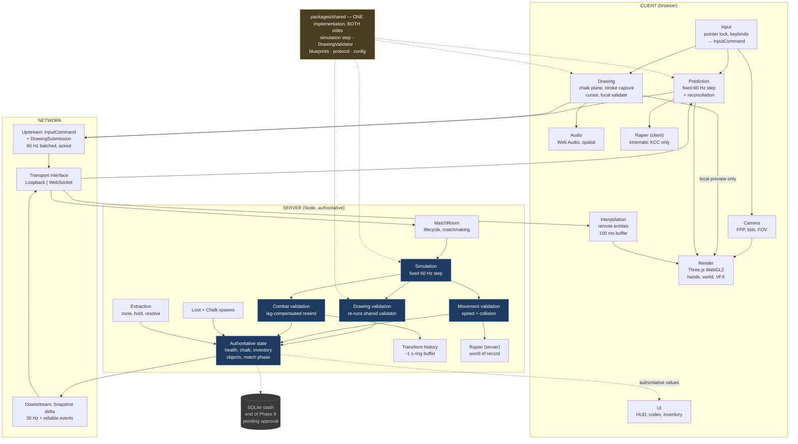

# CHALKBOUND — Technical Architecture

**Date:** 2026-10-07
**Status:** Proposal. Nothing in this document is implemented.
**Authority:** Subordinate to `SPEC.md`. Where this document and `SPEC.md`
disagree, `SPEC.md` wins and this document is wrong and must be corrected.

---

## 1. Technology selection

The repository is empty, so no technology is fixed by prior work. Every choice
below is open and is justified against CHALKBOUND's specific requirements rather
than general preference. Versions are "current stable at time of writing" — pin
whatever `latest` resolves to at install and record it in the lockfile.

### 1.1 Rendering — **Three.js** (`three`, 0.186.x)

| Option | Assessment |
|---|---|
| **Three.js** | **Selected.** Largest ecosystem; best-in-class `GLTFLoader` with KTX2 and Meshopt support, matching the GLB-centric asset pipeline in `CLAUDE.md` §12; full manual control of the render loop, which is required because the client must run a fixed-step prediction loop decoupled from rendering; code-first and fully git-diffable; works headless under Node for tests. |
| Babylon.js | Strong engine, more batteries included (built-in physics plugins, inspector, Havok). Rejected because its higher-level scene abstractions and built-in systems overlap with systems we must own anyway (character controller, prediction), and its larger core works against the payload budget. |
| PlayCanvas | Excellent runtime performance and a genuinely good editor. Rejected because it is editor-centric: scene state lives in a hosted editor rather than in the repository. That conflicts directly with a Claude-Code-driven workflow where every change must be a reviewable text diff. |
| Raw WebGL / WebGPU | Rejected. Months of work to reach parity with `GLTFLoader` alone, for no gameplay benefit. |

**Renderer backend:** `WebGLRenderer` (WebGL2). WebGPU stays behind a feature
flag and is revisited at Phase 10 (see SPEC_AUDIT R-10). A low-poly, lightmapped
school interior reaches 60 FPS comfortably on WebGL2, so WebGPU buys nothing the
MVP needs while costing compatibility.

### 1.2 Physics — **Rapier** (`@dimforge/rapier3d`)

| Option | Assessment |
|---|---|
| **Rapier** | **Selected.** Rust compiled to WASM, the fastest of the three by a wide margin; a first-class `KinematicCharacterController` built in, which is exactly the primitive an FPP controller needs; clean TypeScript bindings; actively maintained; shape-cast and ray-cast queries that melee hit detection and the chalk-plane cursor both depend on. |
| Cannon-es | Pure JavaScript, easy to embed, no WASM payload. Rejected on performance and on the absence of a production character controller — we would write one by hand. |
| Ammo.js | Bullet via Emscripten. Mature physics, but a large payload, an awkward hand-written-binding API, and much weaker TypeScript support. Rejected. |
| Jolt (WASM ports) | Very capable, but JS bindings are less mature than Rapier's and the character controller story is weaker in the browser. Rejected for MVP. |

**Build selection:**

- **Client:** `@dimforge/rapier3d-compat` — base64-embeds the WASM, which costs
  payload size but works across bundlers without special configuration.
- **Server:** `@dimforge/rapier3d` — plain Node, no bundler constraint, so the
  smaller and faster non-compat build applies.

**Determinism — the key decision.** Rapier's standard builds are locally
deterministic but *not* cross-platform deterministic. A `-deterministic` build
exists at a performance cost. **CHALKBOUND does not use it, because the
architecture never requires client and server physics to agree bit-for-bit:**

- Character movement uses a **kinematic** controller. Position is a function of
  input, not of accumulated solver state, so replaying the same inputs
  reproduces the same path within floating-point tolerance — and reconciliation
  corrects any drift every tick anyway.
- Melee is **shape-cast**, not rigid-body collision. The server asks "does this
  capsule sweep intersect that capsule at this tick", which is a stateless
  geometric query.
- Dynamic rigid bodies (loose props, debris) are **cosmetic and client-local**,
  or server-owned and replicated by interpolation. They never affect gameplay
  state.

This removes physics determinism from the critical path entirely, which is what
makes the fast build usable. See SPEC_AUDIT R-08.

### 1.3 Networking — **WebSocket transport, custom fixed-tick protocol**

Requirements from `CLAUDE.md` §7 and §15 and prompt §5: authoritative server, 2–4
players now and 8–16 later, low-latency state sync, server-side validation,
compact stroke data, no raw mouse movement on the wire.

**Transport: WebSocket (binary frames) for MVP, behind a `Transport` interface.**

WebRTC DataChannel (e.g. geckos.io) offers UDP-like unreliable delivery, which
is genuinely better for a twitch shooter — head-of-line blocking on TCP causes a
stall to cascade. But it also brings SDP signalling, STUN, and TURN relays
(which is real operational cost and a real failure surface). At 2–4 players and
a 30 Hz tick with small delta-encoded snapshots, TCP is comfortable. The
`Transport` interface means switching later is a contained change, not a
rewrite.

**Framework: Colyseus (0.16.x) for the room layer only — not for state sync.**

| Option | Assessment |
|---|---|
| **Colyseus, rooms only** | **Selected.** Takes the boring, genuinely tedious parts off the table: room lifecycle, matchmaking, join/leave, reconnection, a fixed-rate simulation interval, and a known hosting story. |
| Colyseus with full `@colyseus/schema` state sync | Rejected as the primary mechanism. Its patch-based replication is excellent for casual and turn-based games but it is not designed around per-client interest management, client-side prediction, or server-side lag-compensated rewind, all three of which the MVP requires. Fighting the framework there would cost more than writing the protocol. |
| Custom `ws` server, no framework | Viable, and only ~600–900 lines. Rejected because that is 600–900 lines of lifecycle and matchmaking plumbing with no gameplay value, and Colyseus's room layer is a good fit for exactly that. |
| Socket.IO | Rejected. Framing and fallback overhead with no benefit when binary frames are the point. |

**The resulting split — this is the important part:**

- **Colyseus `Schema`** carries only low-frequency match state: match phase,
  timers, player roster, scores, extraction-zone status. Changes rarely, and
  automatic delta sync is ideal for it.
- **Raw binary messages** carry the high-frequency gameplay channel: input
  commands upstream, delta-encoded snapshots downstream. Hand-written encoders
  under our control, so prediction, interpolation, and lag compensation are ours
  to tune.

The authoritative simulation itself is plain TypeScript in `packages/shared`,
with no Colyseus types in it, so it is unit-testable in isolation and the
framework stays replaceable.

**Tick rates:**

| Loop | Rate | Rationale |
|---|---|---|
| Client render | Display refresh (uncapped) | Visual smoothness |
| Client prediction step | 60 Hz fixed | Matches server step for clean reconciliation |
| Server simulation step | 60 Hz fixed | Responsive melee; cheap at 4 players |
| Server snapshot broadcast | 30 Hz | Halves bandwidth; interpolation covers the gap |
| Input send | 60 Hz, batched | Unacknowledged commands are resent for loss tolerance |

### 1.4 Backend — single Node process

Node 24 (v24.14.1 is installed locally), TypeScript, Colyseus. One process hosts
the game server and serves the static client build. Containerized, one region.
No message broker, no service mesh, no Redis for MVP — a single authoritative
process is the correct topology for 4-player matches and remains correct through
16.

### 1.5 Database — **none for MVP**

Match state lives in memory and dies with the match. There is nothing to persist
through Phase 9.

The one genuine exception is the persistent stash, without which extraction has
no stakes (see SPEC_AUDIT MD-06 / RD-06). The recommendation is to add
**SQLite via `better-sqlite3`** at the *end* of Phase 9: one file, two tables,
no ORM. That is a library, not infrastructure. **This awaits a decision.**

### 1.6 Supporting toolchain

| Concern | Choice | Rationale |
|---|---|---|
| Package manager | pnpm workspaces (9.15 installed) | Correct workspace support, strict dependency isolation, fast |
| Build / dev server | Vite | Instant HMR, first-class TypeScript, good WASM handling |
| Language | TypeScript, `strict: true` | Mandated by prompt §12 |
| Tests | Vitest | Shares Vite's transform pipeline, so one config serves both |
| Lint / format | ESLint (flat config) + Prettier | Standard |
| Geometry compression | Meshopt (`EXT_meshopt_compression`) | Preferred over Draco: faster decode, smaller decoder, handles geometry and animation |
| Texture compression | KTX2 / Basis Universal | Stays compressed in GPU memory, which directly addresses R-09 |
| Audio | Web Audio API directly | Spatial audio needs per-source control; a wrapper library would be in the way |

**Deliberately excluded for MVP:** React or any UI framework (HUD is a handful
of DOM elements and a canvas overlay; a framework's render cycle would fight the
game loop), state-management libraries, ECS libraries (plain typed systems over
typed arrays are clearer at this scale), and any MCP dependency (per prompt §14 —
the pipeline is *designed* for Blender MCP, but nothing is installed until
Phase 6 needs it).

---

## 2. Repository layout

```text
chalkbound/
├── apps/
│   ├── client/
│   │   ├── src/
│   │   │   ├── main.ts                 # bootstrap, loading, mode switch
│   │   │   ├── render/                 # renderer, scene graph, materials, post
│   │   │   ├── input/                  # pointer lock, keybinds, command builder
│   │   │   ├── camera/                 # FPP camera, view bob, recoil, FOV
│   │   │   ├── player/                 # local controller, prediction, hands
│   │   │   ├── drawing/                # chalk plane, stroke capture, cursor, VFX
│   │   │   ├── entities/               # remote players, Erased, drawn objects
│   │   │   ├── net/                    # transport impls, reconciliation, interp
│   │   │   ├── ui/                      # HUD, codex, inventory, feedback
│   │   │   ├── audio/                  # listener, spatial emitters, mixer
│   │   │   └── assets/                 # loaders, manifest, cache
│   │   └── index.html
│   └── server/
│       └── src/
│           ├── index.ts                # process bootstrap
│           ├── rooms/MatchRoom.ts      # Colyseus room, owns the tick
│           ├── sim/                    # authoritative world, lag compensation
│           ├── validation/             # drawing, movement, combat validators
│           └── persistence/            # EMPTY until end of Phase 9
├── packages/
│   └── shared/
│       └── src/
│           ├── sim/                    # fixed-step simulation (runs both sides)
│           ├── drawing/                # Stroke, Blueprint, DrawingValidator
│           ├── blueprints/             # sword.ts, wall.ts, bridge.ts (data)
│           ├── protocol/               # message types, binary encode/decode
│           ├── config/                 # economy, combat, movement constants
│           └── math/                   # vectors, geometry predicates, fixed step
├── assets/                             # source + exported assets (see ASSET_PIPELINE)
├── tools/blender/                      # Blender Python automation
└── docs/
```

`packages/shared` is the load-bearing idea. The drawing validator, the
simulation step, the economy constants, and the wire protocol exist **once** and
are imported by both sides. That is what makes "the client predicts, the server
decides" cheap rather than a duplicated-logic hazard, and it is what `SPEC.md`
§6 means by forbidding duplicated game logic.

---

## 3. System diagram



**Reading the diagram:** blue is authoritative state and its validators — the
only place gameplay truth exists. Gold is the shared code that both sides run.
Dashed grey is deferred and unapproved. Every upstream arrow carries *intent*;
every downstream arrow carries *facts*.

---

## 4. Client architecture

### 4.1 Rendering

A single `WebGLRenderer`. One `Scene` with explicit layers: world (static,
lightmapped), entities (dynamic), FPP hands (rendered by a second camera with a
narrow FOV and its own near plane, which is how first-person weapons avoid
clipping into walls), chalk plane (transparent overlay), and VFX.

Post-processing for MVP is a single pass at most (mild vignette plus colour
grade). `CLAUDE.md` §14 names excessive post-processing as a cost to avoid; the
chalk aesthetic wants clean contrast, not bloom.

Budget enforced from Phase 6: under 600 draw calls, under 400 MB textures, under
1.5 M visible triangles. A debug overlay shows live counts, and that overlay is
built in Phase 0 so the numbers are visible from the first commit rather than
discovered at Phase 10.

### 4.2 Input

Pointer lock is acquired on a click on the canvas. All mouse motion arrives as
`movementX`/`movementY` deltas, never as absolute coordinates.

Input is converted to a serializable `InputCommand` per simulation tick:

```text
InputCommand {
  seq         uint32   # monotonic, used for acknowledgement
  tick        uint32   # client tick this was produced on
  moveX       int8     # quantized -1..1
  moveZ       int8
  yaw         uint16   # quantized radians
  pitch       uint16
  buttons     uint16   # bitfield: jump, sprint, crouch, attack, interact, draw
}
```

Raw mouse deltas are never sent, satisfying `CLAUDE.md` §15. Yaw and pitch are the
*result* of applying deltas locally, quantized — which is both smaller and
sufficient for the server to validate aim.

**Mode switching** is the input layer's main responsibility. Two modes exist —
`Locomotion` and `Drawing` — and the same deltas route to camera rotation or to
the chalk cursor depending on mode. Pointer lock is held throughout, per
SPEC_AUDIT RD-08.

### 4.3 Camera

A fixed-height FPP camera parented to the predicted player position, with view
bob tied to the movement cycle, a crouch height lerp, and FOV widening slightly
on sprint. During drawing, rotation is frozen and the camera eases forward a few
centimetres toward the chalk plane, which sells the physicality §9 asks for.

### 4.4 Player and prediction

The local player runs the **same** `stepPlayer()` function from
`packages/shared` that the server runs. Each tick:

1. Sample input, build `InputCommand`, push to an unacknowledged ring buffer.
2. Step the shared simulation locally against the client Rapier world.
3. Send the command (batched with a few recent unacknowledged ones).

On receiving a snapshot containing `lastProcessedSeq`:

1. Discard acknowledged commands from the buffer.
2. If the server's authoritative position differs from the client's recorded
   prediction for that tick by more than a threshold, snap to the server
   position and **re-simulate** every remaining unacknowledged command.
3. Smooth the visual correction over ~100 ms rather than snapping the camera.

The client predicts **only** position, velocity, and grounded state. It never
predicts health, chalk, inventory contents, kills, or extraction — those are
displayed strictly from authoritative snapshots, per `CLAUDE.md` §7.

### 4.5 Drawing (client half)

```text
draw input pressed
  → ChalkPlane fades in at 1.2 m, hand raises (150 ms)
  → camera rotation freezes; movement and attack disabled; player VULNERABLE
  → pointer deltas drive a 2D cursor in plane space
  → StrokeRecorder appends points at a fixed sample rate,
    with a minimum-distance filter to reject jitter
  → scratch audio loop, gain tracking cursor speed
  → chalk dust particles at cursor
  → release → local validator CLASSIFIES + GRADES, for INSTANT FEEDBACK ONLY
  → DrawingSubmission sent upstream (strokes only; no authoritative intent)
  → translucent non-colliding ghost rendered (hides the round-trip)
  → server outcome → glow burst naming the recognized blueprint
                   → real object becomes solid, or the sketch smudges away
```

There is **no blueprint pre-selection step**, per `SPEC.md` §6.2. The player
raises the chalk and draws; what they drew is determined afterward.

The local outcome drives feedback and nothing else. The chalk debit, the
classification of record, and the object spawn all wait for the server. Because
both sides run the identical classifier and grader on the identical quantized
strokes, the local prediction matches the server's essentially always — so the
player perceives an instant response while the server remains the sole
authority.

One UI requirement follows directly from inference: **the creation VFX names the
blueprint that was recognized** as it resolves. Under pre-selection the player
already knew what they asked for; under inference they do not, so a misread must
be visible at the moment it happens rather than discovered later in a fight
(SPEC_AUDIT R-11 mitigation 4).

### 4.6 UI, audio, interpolation

- **UI** is plain DOM plus one canvas overlay for the stroke trail. Every value
  displayed comes from authoritative state. No gameplay logic lives in UI code.
- **Audio** uses Web Audio directly: an `AudioListener` on the camera,
  `PannerNode` per spatial source, and a small bus mixer (master / SFX / ambient
  / UI). Chalk scratch is a looping source whose gain and playback rate follow
  cursor velocity.
- **Interpolation** buffers remote entity snapshots and renders them ~100 ms in
  the past, interpolating between the two straddling snapshots. Remote players
  are never predicted — being shown a remote player where they actually were is
  correct, and it is what makes server-side rewind (§5.4) coherent.

---

## 5. Server architecture

### 5.1 Match lifecycle

`MatchRoom` owns one match. States: `Lobby → Warmup → Active → Resolving →
Complete`. The room drives a fixed 60 Hz accumulator step and a 30 Hz broadcast.
All gameplay logic is called *from* the room but *lives* outside it — the room is
a scheduler and a socket owner, nothing more, per `CLAUDE.md` §20.

### 5.2 Movement validation

The server runs the identical shared `stepPlayer()` against its own Rapier world
using the client's submitted commands. The server's result *is* the player's
position; the client's reported position is never read. Commands with implausible
timing or an out-of-range tick are dropped, and command rate is capped per
player.

This makes speed and collision cheating structurally impossible rather than
detected: a client that claims to be somewhere simply has no field in which to
claim it.

### 5.3 Drawing validation

On `DrawingSubmission`:

1. Reject outright if the player is dead or the submission rate is exceeded.
2. **Run the shared validator** — classify, reject, grade — on the submitted
   strokes. This is the same code the client ran, so there is no second
   implementation to drift. The client's locally-inferred `blueprintId`, if
   present, is treated as a **hint for diagnostics only** and never as input to
   the decision.
3. Apply the anti-automation constraints (minimum duration, maximum point
   velocity, jitter floor) as ordinary validator constraints.
4. Resolve cost and effect from the outcome:

| Outcome | Server action |
|---|---|
| `created` | Debit full cost, spawn into the Rapier world and authoritative state, stamp with the current tick, broadcast `ObjectSpawned` |
| `smudged` | Debit 25% of that blueprint's cost, broadcast the failed constraint list for specific feedback |
| `unrecognized` | Debit flat 5, broadcast the rejection reason |
| `unaffordable` | Debit flat 5, create nothing |

**Ordering matters and is load-bearing under inference.** The server
*classifies, then grades, then debits* — cost is a property of the blueprint
that was recognized, so it cannot be known before classification (SPEC_AUDIT
RD-02/RD-03). The affordability check therefore happens *after* classification,
not before, which is why `unaffordable` is a distinct outcome rather than an
early rejection. The server never needs a refund path.

**Disagreement logging.** When the client's hint differs from the server's
classification, the server logs both plus the sketch. A nonzero rate here is the
earliest warning that `RECOGNITION_FLOOR` or `AMBIGUITY_MARGIN` is mistuned, or
that two blueprints have drifted too close together — which is exactly the
failure mode R-11 describes. It costs one log line and is the cheapest telemetry
in the project.

### 5.4 Combat validation with lag compensation

The hardest piece in the MVP (SPEC_AUDIT R-02).

The server keeps a ring buffer of every player's transform for the last ~1
second. On an attack command:

1. Read the attacker's acknowledged tick from the command.
2. Clamp the rewind to a maximum (200 ms) so a client cannot claim arbitrary
   latency to reach into the past.
3. Rewind candidate targets to their interpolated transforms at that tick.
4. Shape-cast the sword arc against those rewound capsules.
5. Apply damage authoritatively at the current tick, broadcast the result.

This means the server tests the hit against *what the attacker actually saw*,
which is the only way melee feels fair under latency. It also means a target can
occasionally be hit just after moving behind cover on their own screen — the
standard and accepted trade, bounded by the rewind clamp.

Attack rate, stamina cost, reach, and weapon durability are all checked
server-side. The client plays the swing animation immediately and applies no
damage.

### 5.5 Drawn objects and the collision world

Per SPEC_AUDIT R-03, this is treated as a first-class concern rather than a
detail. Every drawn object carries `solidFromTick`. Clients replaying predicted
commands include an object's collider only for ticks at or after that value, so
client and server agree on the collision world at every replayed tick. Until
confirmation the client shows a ghost with no collider.

### 5.6 Loot, chalk, extraction

Chalk spawns and loot containers are placed at authored spawn points with
server-side randomization at match start. Pickup is an intent the server
validates on proximity, never a client-side grant.

Extraction: entering a zone starts a server-side timer; taking damage resets it;
completing it removes the player from the match and records their carried chalk
and inventory as the match result. Whether that result then persists depends on
the open MD-06 decision.

### 5.7 Persistence

Nothing, through Phase 9. The `persistence/` directory exists as an empty
boundary so adding SQLite later touches one module rather than the simulation.

---

## 6. Drawing system design

The most important subsystem, and the one most likely to be rewritten if
designed badly. The goal from prompt §7 is that sword, wall, and bridge all use
one generic framework, and that new blueprints are **data, not code**.

**Design input (approved 2026-10-07):** recognition is by **inference**, not
selection. The player draws freely and the sketch determines the object
(`SPEC.md` §6.2). The validator is therefore a classifier *and* a grader, with a
mandatory rejection stage between them.

### 6.1 Core types

```ts
// A point in normalized chalk-plane space, origin at plane centre.
type PlanePoint = { x: number; y: number; t: number };   // t = ms since stroke start

interface Stroke {
  points: PlanePoint[];
  durationMs: number;
}

// What the player produced. Note: NO blueprintId — the sketch does not
// declare its intent, and the server does not accept a claim about it.
interface Sketch {
  strokes: Stroke[];
  durationMs: number;
}

interface BlueprintTemplate {
  id: BlueprintId;
  chalkCost: number;
  discriminators: Discriminators;   // used by classification, see 6.3
  constraints: Constraint[];        // used by grading, see 6.4
  minAccuracy: number;              // grading pass threshold, 0..1
  spawn: SpawnDescriptor;           // resolved by the spawn registry
}

type DrawingOutcome =
  | { kind: 'created';      blueprintId: BlueprintId; accuracy: number; quality: Quality }
  | { kind: 'smudged';      blueprintId: BlueprintId; accuracy: number; failures: ConstraintFailure[] }
  | { kind: 'unrecognized'; bestCandidate?: BlueprintId; reason: 'below-floor' | 'ambiguous' }
  | { kind: 'unaffordable'; blueprintId: BlueprintId; required: number; held: number };
```

`DrawingOutcome` is a discriminated union rather than a boolean plus fields
because inference has four genuinely different results, each with a different
chalk cost and a different UI response (`SPEC.md` §6.6). Collapsing them into
`passed: boolean` would lose exactly the distinction the design depends on —
between a sketch the player drew badly and a sketch the system could not read.

### 6.2 Normalization

Before any constraint runs, a drawing is normalized so that validation is
position- and scale-invariant but **deliberately not rotation-invariant** — a
vertical blade and a horizontal one are different drawings, and the design wants
that to matter.

1. Resample each stroke to a fixed point count (32) by arc length. This makes
   fast and slow strokes comparable and bounds all downstream cost.
2. Compute the bounding box of the *whole drawing*, not per stroke.
3. Translate so the box centre is the origin; scale uniformly (preserving aspect
   ratio) so the longer axis spans 1.0.

Normalization is pure and lives in `shared/drawing/normalize.ts`. Both sides run
it on identical quantized input, so both get identical results.

### 6.3 Classification and rejection

```text
Sketch
  → normalize (6.2)
  → extract discriminators once
  → score every blueprint candidate
  → STAGE 1: pick the best
  → STAGE 2: reject if below floor, or if top two are too close
  → STAGE 3: grade the winner against its full constraint set (6.4)
  → DrawingOutcome
```

**Discriminators** are cheap, order-of-magnitude features computed once per
sketch and shared by every candidate comparison. They correspond exactly to the
distinctness rules in `SPEC.md` §6.3, which is what keeps the design document
and the code describing the same thing:

```ts
interface Discriminators {
  strokeCount: number;
  hasIntersection: boolean;      // any stroke crosses any other
  hasClosure: boolean;           // any stroke returns to its own start
  aspect: 'tall' | 'square' | 'wide';
  dominantAngles: number[];      // per stroke, radians, normalized
}
```

Classification is two-tier, which keeps it fast and predictable:

1. **Hard filter.** Candidates whose `strokeCount`, `hasIntersection`, or
   `hasClosure` disagree with the sketch are eliminated outright. For the MVP's
   three blueprints this usually leaves exactly one candidate, because the set
   was chosen to make it so.
2. **Soft score.** Survivors are ranked by weighted `TemplateDistance` plus
   aspect and angle agreement, producing a score in 0..1.

**Rejection** then applies two independent tests, and failing either returns
`unrecognized`:

| Test | Constant | Meaning |
|---|---|---|
| Recognition floor | `RECOGNITION_FLOOR` | the best score must clear it |
| Ambiguity margin | `AMBIGUITY_MARGIN` | best must beat runner-up by at least this |

Both live in `shared/config/drawing.ts`, and both are tuned toward **more
rejections, never more misclassifications** (SPEC_AUDIT R-11). The asymmetry is
deliberate and worth restating in code comments where the constants are defined:
an honest failure costs the player 5 chalk and teaches them the shape; a misread
costs them the fight and teaches them the game is unreliable.

When only one candidate survives the hard filter, the ambiguity margin is
trivially satisfied and only the floor applies. That is the common case, and it
is why classification adds negligible cost over the grading the validator would
have done anyway under the pre-selection design.

### 6.4 Constraints — composable, data-driven

A `Constraint` scores one geometric property and returns a score plus a pass
flag. This is the extension point: new blueprints combine existing constraints,
and genuinely new shapes add one constraint used by many blueprints.

```ts
interface Constraint {
  readonly kind: string;
  evaluate(d: NormalizedDrawing): { score: number; passed: boolean; detail?: string };
  readonly weight: number;
}
```

MVP constraint library:

| Constraint | Checks |
|---|---|
| `StrokeCount` | number of strokes in range |
| `Straightness` | path length ÷ endpoint distance, for lines |
| `Direction` | dominant angle of stroke *k* within tolerance |
| `RelativeLength` | length ratio between two strokes |
| `Intersection` | stroke A crosses stroke B, optionally within a normalized position band along A, measured from A's low end so draw order cannot move it (SPEC_AUDIT D-06a) |
| `EndpointProximity` | end of A near start of B (connected forms) |
| `Closure` | first and last point of a stroke are near each other |
| `AspectRatio` | bounding-box width ÷ height in range |
| `TemplateDistance` | mean per-point distance to a reference path, after normalization |
| `Timing` | total duration within range |
| `HumanLikeness` | max point velocity and a jitter/entropy floor (anti-automation) |

`accuracy` is the weighted mean of constraint scores. `passed` requires every
`passed` flag true **and** `accuracy >= minAccuracy`. Keeping both means a
drawing cannot pass by scoring well on average while violating something
structural, such as a crossguard that never crosses the blade.

### 6.5 Why not just a gesture recognizer

The well-known gesture recognizers (`$1`, Protractor) *are* classifiers — they
pick the best of N templates — so under the inference design they are much
closer to what CHALKBOUND needs than they would have been under pre-selection.
They are still not sufficient on their own, for three reasons:

1. **They are rotation-invariant.** CHALKBOUND must not be: a vertical blade and
   a horizontal one are different sketches, and §6.2's normalization
   deliberately preserves orientation.
2. **They classify but do not grade.** They return a best match, not a quality
   score. Pillar 4 requires accuracy to drive object quality.
3. **They do not explain.** A distance metric cannot say *which part* was wrong,
   and `SPEC.md` §15 requires specific feedback because that is how players learn
   the shapes.

So `TemplateDistance` borrows the useful half of `$1` — resample, then measure
mean point distance — and runs it as one weighted input to the soft score in
§6.3 and one weighted feature in grading. The hard discriminator filter supplies
the orientation sensitivity and the speed; the explicit constraints supply the
grade and the explanation.

### 6.6 Blueprints as data

```ts
export const SWORD: BlueprintTemplate = {
  id: 'sword',
  chalkCost: ECONOMY.sword.cost,
  minAccuracy: 0.6,

  // Used by classification (6.3). Asserted mutually distinct by test.
  discriminators: {
    strokeCount: 2,
    hasIntersection: true,
    hasClosure: false,
    aspect: 'tall',
    dominantAngles: [-Math.PI / 2, 0],         // blade vertical, guard horizontal
  },

  // Used by grading (6.4).
  constraints: [
    straightness(0, 0.9),                      // blade is a straight line
    direction(0, -90, 25),                     // blade roughly vertical
    straightness(1, 0.85),                     // crossguard straight
    direction(1, 0, 25),                       // crossguard roughly horizontal
    intersection(0, 1, { at: [0.1, 0.4] }),    // crosses low on the blade
    relativeLength(1, 0, [0.25, 0.55]),        // guard shorter than blade
    timing({ minMs: 250, maxMs: 6000 }),
    humanLikeness(),
  ],

  spawn: { kind: 'weapon', asset: 'CB_WEAPON_Sword_A', scaleFromAccuracy: true },
};
```

Wall and bridge are the same shape of declaration with different values. Adding
a blueprint means adding one data file, registering one spawn handler, and
passing the distinctness test. No validator code changes. That is the
requirement from prompt §7, satisfied structurally rather than by convention.

**The distinctness test is part of the framework, not of each blueprint.** One
test iterates every pair in the registry and asserts they differ on at least two
discriminators, so a confusable blueprint fails CI rather than reaching a player
(`SPEC.md` §6.3, SPEC_AUDIT R-11 mitigation 2). This is what makes the
inference design safe to extend.

### 6.7 Wire format

Points quantize to `int16` in normalized space and delta-encode along each
stroke, with varint timing deltas. A two-stroke sword at 32 points per stroke is
roughly 100–150 bytes after encoding.

This matters more than it first appears: a drawing is a **discrete low-frequency
event**, not continuous state. The client can send the complete stroke data once,
and the server can re-validate the exact same bytes with the exact same code.
There is no determinism problem, no streaming, and no interpolation — which is
why `CLAUDE.md` §15's "compact stroke data" instruction is not just a bandwidth
optimization but the thing that makes server-authoritative drawing tractable at
all.

**On the `blueprintId` field.** `CLAUDE.md` §15 sketches the wire shape as
`{ blueprintId, strokes, duration }`. Under inference, `blueprintId` is an
*output* of validation, not an input to it. The field is retained in
`DrawingSubmission` as the client's locally-inferred hint — which keeps the
message shape compatible with §15 and makes the disagreement logging in §5.3
possible — but it is **advisory only**. The server computes its own
classification and ignores the hint when deciding. This satisfies `CLAUDE.md`
§7's rule that the client must never be trusted to assert "this drawing is
valid", and now also "this drawing is a sword".

---

## 7. Protocol summary

**Upstream (client → server), all treated as intent:**

| Message | Reliability | Rate |
|---|---|---|
| `InputCommand` batch | unreliable, acked by seq | 60 Hz |
| `DrawingSubmission` | reliable | on demand |
| `InteractIntent` | reliable | on demand |
| `AttackIntent` | reliable (carries client tick) | on demand |
| `InventoryIntent` | reliable | on demand |

**Downstream (server → client), all treated as fact:**

| Message | Reliability | Rate |
|---|---|---|
| `Snapshot` (delta, per-client interest-filtered) | unreliable | 30 Hz |
| `DrawingResult` | reliable | on demand |
| `ObjectSpawned` / `ObjectDestroyed` | reliable | on demand |
| `DamageEvent` / `DeathEvent` | reliable | on demand |
| `MatchState` (Colyseus schema) | reliable | on change |
| `ExtractionResult` | reliable | on demand |

Interest management is scoped per client from Phase 8 onward: a player receives
entity state only for what is near or visible to them. At 4 players this is an
optimization; at 16 it is required, and it also removes wallhack-by-packet-sniff
as a class of cheat.

---

## 8. Testing strategy

`CLAUDE.md` §16 names drawing, blueprint, chalk, inventory, combat, extraction,
match, and networking as the systems requiring tests.

Because the simulation and validator are pure functions in `packages/shared`
with no renderer or socket dependency, the valuable tests are plain fast unit
tests:

| Target | Approach |
|---|---|
| **Classification confusion matrix** | Every fixture carries its intended blueprint. Asserts **zero misclassifications**, and tracks the rejection rate as a reported metric rather than a pass/fail. Under the inference design this is the highest-value test in the project (SPEC_AUDIT R-11 mitigation 3). |
| **Blueprint distinctness** | Iterates every pair in the registry and asserts they differ on at least two discriminators, so a confusable new blueprint fails CI (`SPEC.md` §6.3). |
| Grading | Fixture strokes (recorded from real play, plus hand-built edge cases) asserted against expected accuracy bands |
| Rejection thresholds | Deliberately ambiguous and deliberately sloppy fixtures must return `unrecognized`, not a guess |
| Constraints | Table-driven, one table per constraint |
| Normalization | Property tests: translation and scale invariance, rotation *non*-invariance |
| Economy | Chalk debit and penalty arithmetic |
| `stepPlayer()` | Given identical inputs from identical state, position matches within tolerance — the property reconciliation depends on |
| Combat | Lag-compensated hit resolution against synthetic transform histories |
| Extraction / match | State-machine transitions |
| Protocol | Round-trip encode/decode, including quantization error bounds |
| Reconciliation | Simulated packet loss and latency over `LoopbackTransport` |

`LoopbackTransport` with injectable artificial latency, jitter, and loss means
netcode is testable in a unit test, with no second process and no real socket.

---

## 9. Performance architecture

Target 60 FPS, floor 30 FPS (`SPEC.md` §16).

| Budget | Limit | Enforced by |
|---|---|---|
| Draw calls | < 600 | Instancing, per-room static merging |
| Visible triangles | < 1.5 M | LODs, room culling |
| Texture memory | < 400 MB | KTX2, atlasing, shared materials |
| Realtime lights | ≤ 3 | Baked lightmaps for everything static |
| Realtime shadow casters | ≤ 1 | Players and Erased only, no static geometry |
| Post-processing passes | ≤ 1 | Vignette and grade only |
| Initial payload | < 15 MB | Lazy physics WASM, per-area asset loading |
| Snapshot bandwidth | < 12 KB/s per player at 4 players | Delta encoding, quantization, interest management |

Decisions that follow from the budget:

- **Static lighting is baked in Blender** into lightmaps. The Abandoned School is
  a static interior; realtime global illumination would be the single largest
  avoidable cost.
- **Repeated modules are instanced.** Desks, chairs, and lockers are the obvious
  `InstancedMesh` candidates and also the highest-count props.
- **Room-based culling.** The school's room-and-corridor topology suits a
  hand-authored cell-and-portal scheme, authored as part of the level data rather
  than computed at runtime.
- **The debug overlay ships in Phase 0,** showing frame time, draw calls,
  triangles, texture memory, WASM heap, and network rates. Measuring from the
  first commit is how the budget stays honest.

---

## 10. Architectural invariants

Short enough to check a pull request against.

1. The client sends intent. The server sends facts. Never the reverse.
2. Gameplay logic exists once, in `packages/shared`. If it is implemented twice,
   it is a bug.
3. The client predicts movement only. Never health, chalk, inventory, kills, or
   extraction.
4. Netcode never depends on physics determinism.
5. Drawn objects become solid only on server confirmation.
6. No gameplay constant is written inline. All of them live in `shared/config`.
7. No module mixes rendering, networking, game rules, and UI.
8. The simulation imports no renderer and no socket, so it stays unit-testable.
9. Colyseus types never appear inside the simulation.
10. The drawing validator is the same code on both sides, run on the same
    quantized bytes.
11. The client never asserts *what* it drew. `blueprintId` on a submission is a
    hint for diagnostics; the server classifies for itself.
12. When classification is uncertain, the system **refuses**. Rejection is
    always preferred to a guess.
