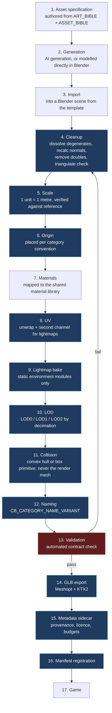
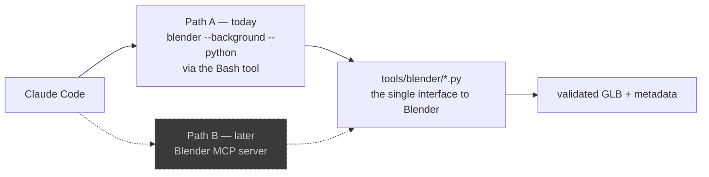

# CHALKBOUND — Asset Pipeline

**Date:** 2026-10-07
**Status:** Architecture proposal. No tooling and no assets exist yet.
**Scope:** This document defines the *architecture* of the pipeline. Per prompt
§13 and SPEC_AUDIT R-04, the **tooling is built in Phase 6, not now**, and no
final art is produced before the vertical slice passes its feel gate.

---

## 1. Principles

From `CLAUDE.md` §11, §12, §13, §18, §19:

1. **Blender is the source of truth.** Not the GLB, not the AI output. If an
   asset needs changing, the `.blend` changes and the GLB is re-exported.
2. **Nothing enters the game unprocessed.** AI-generated geometry is raw
   material, never a shippable asset.
3. **Modular, never monolithic.** The map is assembled from reusable components
   at runtime. No single-mesh environments.
4. **Automated, not manual.** Anything repeatable is a Blender Python script in
   `tools/blender/`. Scripts are deterministic — the same inputs produce the same
   GLB.
5. **Validated, not trusted.** The export script rejects assets that violate the
   contract rather than relying on discipline.
6. **Greybox until proven.** Phases 0–5 use primitives. The pipeline runs for the
   first time in Phase 6.

Principle 6 is the one most likely to be violated under enthusiasm, and the one
with the largest cost if it is. The modular school is the biggest single expense
in the MVP; spending it before knowing whether drawing a sword is fun is the main
scheduling risk in the project.

---

## 2. Pipeline stages

The required sequence from `CLAUDE.md` §12, with the generation front-end from
prompt §13:



Blue stages are scripted and run without human input. The red stage is a gate:
an asset that fails validation does not export.

---

## 3. Directory layout

```text
assets/
├── source/                          # NOT shipped — the real source of truth
│   ├── env/
│   │   ├── CB_ENV_Wall_A.blend
│   │   └── CB_ENV_Floor_A.blend
│   ├── prop/
│   │   ├── CB_PROP_Desk_A.blend
│   │   └── CB_PROP_Locker_A.blend
│   ├── weapon/CB_WEAPON_Sword_A.blend
│   ├── char/CB_CHAR_Player_A.blend
│   ├── pve/CB_PVE_ErasedSword_A.blend
│   └── game/CB_GAME_ChalkBox_A.blend
│
├── generated/                       # raw AI output, quarantined, NOT shipped
│   └── <date>/<request-id>/
│
├── textures/
│   ├── source/                      # authoring resolution (PNG/EXR)
│   └── ktx2/                        # compressed, shipped
│
├── exported/                        # shipped GLBs
│   ├── env/CB_ENV_Wall_A.glb
│   ├── env/CB_ENV_Wall_A.meta.json
│   └── ...
│
├── levels/
│   └── abandoned_school.json        # module placements, portals, spawn points
│
└── manifest.json                    # generated, never hand-edited
```

`assets/generated/` is deliberately quarantined. AI output is untrusted input: it
arrives with arbitrary scale, arbitrary origin, degenerate geometry, and
sometimes unusable topology. It is read from, processed, and never shipped or
referenced directly.

---

## 4. Naming contract

From `CLAUDE.md` §13: `CB_<CATEGORY>_<NAME>_<VARIANT>`.

| Category | Use | Example |
|---|---|---|
| `ENV` | Structural modules | `CB_ENV_Wall_A` |
| `PROP` | Set dressing | `CB_PROP_Desk_A` |
| `WEAPON` | Weapons | `CB_WEAPON_Sword_A` |
| `GAME` | Gameplay-functional objects | `CB_GAME_ChalkBox_A` |
| `CHAR` | Player characters | `CB_CHAR_Player_A` |
| `PVE` | Creatures | `CB_PVE_ErasedSword_A` |
| `DRAWN` | Objects created by drawing | `CB_DRAWN_Wall_A` |
| `VFX` | Effect meshes and sprites | `CB_VFX_ChalkDust_A` |

Rules the validator enforces: `PascalCase` name, single-letter variant,
category from the fixed set above, and the Blender object name, the `.blend`
filename, and the exported GLB filename all identical. Mismatch is an export
failure, not a warning.

---

## 5. Technical contract

Every asset satisfies all of this or does not export.

### Scale and orientation

- 1 Blender unit = 1 metre.
- Z-up in Blender; the GLB exporter handles Y-up conversion for Three.js.
- Scale is verified against a reference human height of 1.8 m present in the
  scene template.

### Origin placement by category

| Category | Origin |
|---|---|
| `ENV` modules | Bottom-centre of the module's grid cell, so modules snap |
| `PROP` | Bottom-centre of the footprint, so props sit on floors |
| `WEAPON` | At the grip point, so hand attachment needs no offset |
| `CHAR` / `PVE` | Between the feet, at floor level |
| `GAME` | Bottom-centre |

Origin convention is the most frequent source of asset bugs and the cheapest
thing to validate automatically, so it is validated automatically.

### Modular grid

Environment modules snap to a **4 m horizontal grid**, with a **3 m floor-to-
floor height** and **1 m vertical increments** for partial pieces. Fixed early
because changing it after the school is authored means re-authoring the school.

### Geometry budgets

| Category | LOD0 triangles | LODs | Collision |
|---|---|---|---|
| `ENV` wall / floor | ≤ 500 | 2 | Box primitive |
| `ENV` stairs / door | ≤ 1,500 | 2 | Convex hull |
| `PROP` small | ≤ 800 | 2 | Box primitive |
| `PROP` large | ≤ 2,500 | 3 | Convex hull |
| `WEAPON` | ≤ 3,000 | 2 | Capsule (code-defined) |
| `CHAR` / `PVE` | ≤ 12,000 | 3 | Capsule (code-defined) |
| `GAME` | ≤ 1,500 | 2 | Box primitive |

LOD ratios: LOD1 at ~50% and LOD2 at ~20% of LOD0, by decimation. Switch
distances live in the metadata sidecar, not in code.

**Collision is never the render mesh.** Box primitives wherever the shape allows,
convex hulls where it does not, and code-defined capsules for anything that
moves. This is the single largest physics-performance decision in the project.

### Materials

A shared material library, because draw calls are batched by material and the
Phase 6 budget (under 600 draw calls) depends on it.

- PBR metallic-roughness only.
- Channel-packed ORM textures (occlusion / roughness / metallic in R / G / B).
- A second UV channel reserved for lightmaps on all static `ENV` geometry.
- No transparency unless unavoidable (`CLAUDE.md` §14 names excessive transparency
  explicitly); alpha-test in preference to alpha-blend.
- Texture resolution: 1024 for `ENV` and large `PROP`, 512 for small `PROP`,
  2048 only for `CHAR` and `WEAPON`.

### Compression

- **Geometry: Meshopt** (`EXT_meshopt_compression`). Chosen over Draco for
  faster decode, a smaller runtime decoder, and support for animation data as
  well as geometry.
- **Textures: KTX2 / Basis Universal**, UASTC for normal maps (where quality
  matters) and ETC1S for albedo and ORM (where size matters). KTX2 stays
  compressed in GPU memory, which is what keeps the 400 MB texture budget
  reachable (SPEC_AUDIT R-09).

---

## 6. Metadata sidecar

Every exported GLB carries `<name>.meta.json`. This is the provenance and
licensing record required by SPEC_AUDIT RD-12, and it is written by the export
script rather than by hand.

```json
{
  "id": "CB_ENV_Wall_A",
  "category": "ENV",
  "version": 3,
  "source": {
    "blend": "assets/source/env/CB_ENV_Wall_A.blend",
    "origin": "ai-generated",
    "tool": "<generator name and version>",
    "prompt": "<verbatim generation prompt>",
    "licence": "<licence of the generated output>",
    "processedAt": "2026-10-07T00:00:00Z",
    "processedBy": "tools/blender/export_glb.py@<git sha>"
  },
  "geometry": {
    "lod0Triangles": 412,
    "lodCount": 2,
    "lodDistances": [0, 15, 40],
    "boundsMetres": [4.0, 3.0, 0.2]
  },
  "collision": { "type": "box", "dimensions": [4.0, 3.0, 0.2] },
  "materials": ["CB_MAT_Concrete_A"],
  "textures": { "totalBytes": 1398101, "format": "ktx2-etc1s" },
  "grid": { "snap": 4.0, "occupies": [1, 1, 1] }
}
```

The generation prompt is recorded verbatim, which makes an asset regenerable and
makes the licensing position auditable. Both matter more than they appear to
during an MVP.

---

## 7. Blender automation

Scripts in `tools/blender/`, as named in `CLAUDE.md` §19. Built in Phase 6.

### Library modules

| Script | Responsibility |
|---|---|
| `lib/scene.py` | Load the scene template, reference human, grid helpers |
| `lib/cleanup.py` | Remove doubles, recalc normals, dissolve degenerates, validate manifold |
| `lib/transform.py` | Scale verification, origin placement by category |
| `lib/materials.py` | Map to the shared library, channel-pack ORM |
| `lib/uv.py` | Unwrap, lightmap channel creation |
| `lib/lod.py` | Decimation-based LOD generation |
| `lib/collision.py` | Box and convex-hull collision generation |
| `lib/validate.py` | The export contract gate |
| `lib/metadata.py` | Sidecar generation |

### Entry points

| Script | Purpose |
|---|---|
| `process_asset.py` | Full pipeline for one asset: import → validate → export |
| `generate_lods.py` | Regenerate LODs for an existing `.blend` |
| `export_glb.py` | Validate and export; refuses on contract failure |
| `setup_lighting.py` | Lighting rig for lightmap baking |
| `bake_lightmaps.py` | Bake static environment lighting |
| `create_classroom.py` | Assemble a classroom from modules |
| `create_hall.py` | Assemble a corridor from modules |
| `validate_all.py` | CI entry point: validate every asset |

All are invoked headless:

```bash
blender --background --python tools/blender/process_asset.py -- \
  --input assets/generated/2026-10-07/wall-001/mesh.glb \
  --category ENV --name Wall --variant A
```

Determinism requirement (`CLAUDE.md` §19): no random seeds, no timestamps inside
geometry data, no dependence on UI state or selection. Re-running a script on
the same input produces a byte-identical GLB. That is what makes the pipeline
reviewable in git — an unexplained diff means something actually changed.

---

## 8. Blender MCP — designed for, not depended on

Prompt §14 asks that the pipeline *be able* to support Claude Code driving
Blender through MCP later, while §14 also says not to add MCP dependencies before
they are needed.

Both are satisfied by the structure above, with no MCP dependency today:



The scripts are the interface to Blender. Path A invokes them through headless
CLI, which works now with zero new dependencies. Path B would invoke the same
functions through an MCP server for interactive, stateful work — inspecting a
scene, iterating on a mesh, responding to what it finds.

What this requires of the scripts, and the reason to state it now rather than
discover it later:

1. Every script is a thin CLI wrapper around an importable function. MCP calls
   the function; the CLI calls the function. Neither path is privileged.
2. No script depends on interactive selection or UI state.
3. All parameters are explicit arguments. No hidden configuration.
4. Scripts return structured results (JSON on stdout), not just log text, so a
   caller can act on the outcome.

Honouring those four points costs nothing in Phase 6 and is what makes the MCP
path a later addition rather than a later rewrite. **No MCP dependency is added
until there is interactive asset work that the headless path genuinely cannot
do.**

---

## 9. Runtime loading

### Manifest

`assets/manifest.json` is generated by `validate_all.py` and never hand-edited.
It lists every asset with its path, hash, byte size, LOD distances, collision
descriptor, and the area tag that controls when it loads.

### Loader

`GLTFLoader` with `KTX2Loader` and `MeshoptDecoder` installed. A central
`AssetCache` keyed by asset id guarantees one load per asset per session, with
geometry and materials shared across all instances — which is what makes
`InstancedMesh` batching possible.

### Load strategy

| Stage | Loads |
|---|---|
| Boot | UI, fonts, the loading screen itself |
| Match join | Player, sword, chalk box, drawn-object meshes, the Erased |
| Area enter | Environment modules and props for that area |
| Never | Anything not reachable in the current match |

Physics WASM loads after first paint, behind the loading screen (SPEC_AUDIT
R-06). Initial payload budget is 15 MB.

### Drawn objects are a special case

Objects created by drawing cannot be fully authored, because their proportions
derive from the player's strokes and their quality from `accuracy`. They use a
hybrid: an authored base mesh from `CB_DRAWN_*` with runtime parameterization
(scale, proportion, chalk-edge shader intensity) driven by the `DrawingResult`.

This keeps the asset pipeline out of the hot path — no runtime mesh generation,
no per-drawing geometry upload — while still letting a well-drawn sword look
different from a barely-passing one. It is the only place where gameplay data
reaches into asset presentation, and it is deliberately confined to parameters
on a fixed mesh.

---

## 10. CI validation

`validate_all.py` runs in CI on any change under `assets/`, and fails the build
on:

- A naming-convention violation.
- A triangle count over the category budget.
- A missing LOD or missing collision.
- A missing or malformed metadata sidecar.
- A missing provenance or licence field.
- A material outside the shared library.
- An uncompressed texture in `exported/`.
- A scale or origin convention violation.
- A manifest entry whose hash does not match the file.

Making these build failures rather than review comments is the point. An asset
pipeline enforced by convention decays; one enforced by a script does not.

---

## 11. What is deliberately not built yet

Per prompt §13 and §14, and SPEC_AUDIT R-04:

- No final art assets. Phases 0–5 are greybox primitives.
- No Blender scripts until Phase 6.
- No MCP server, and no MCP dependency in `package.json`.
- No texture authoring tooling.
- No animation pipeline beyond what Phase 7 needs for the Erased.
- No asset streaming system. Per-area loading is sufficient for one school.

What **is** established now is the architecture: directory layout, naming
contract, technical budgets, metadata schema, validation gate, and the MCP-ready
script shape. Those are the decisions that are expensive to change later and
free to make now — which is the correct trade and the reason this document exists
before any of its tooling does.
