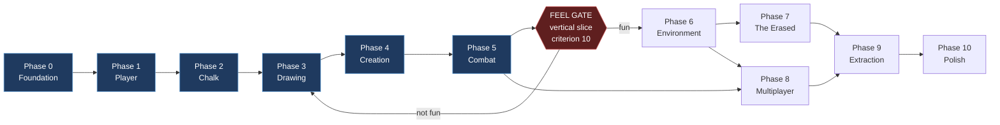

# CHALKBOUND — Development Roadmap

**Date:** 2026-10-07
**Status:** Phases 0–2 implemented (2026-10-07). Phase 1 feel was tuned once (jump, hands); Phase 2 awaits the user's play check. Later phases are proposals.
**Rule (prompt §11):** each phase requires explicit approval before it starts.
Completing one phase does not authorize the next.

---

## 0. How to read this

Every phase lists **deliverables** (what exists at the end), **exit criteria**
(how we know it is done), and **tests**. Estimates are working-day ranges for a
single focused developer working with Claude Code; they are planning aids, not
commitments.

Two structural notes carried over from `docs/SPEC_AUDIT.md`, **both approved
2026-10-07** and reflected in the phases below:

- **D-01** — the authoritative loop structure is introduced at Phase 0 rather
  than Phase 8. Phase order and deliverables are unchanged; only the plumbing
  underneath moves earlier. Rationale, cost, and impact in SPEC_AUDIT §5.
- **D-02** — three specific audio/VFX items (chalk scratch audio, chalk dust
  particles, stroke glow) move from Phase 10 into Phase 3, because they are the
  drawing mechanic's feedback channel and the Phase 3 feel gate cannot be judged
  without them.

One design decision also lands on this roadmap: **recognition is by inference,
not selection** (`SPEC.md` §6.2, approved 2026-10-07). The player draws freely
and the sketch determines the object. This adds classification, ambiguity
rejection, and the Codex to Phase 3, and it adds one acceptance criterion to the
vertical slice.

Phases 0 through 5 use **greybox primitives only** — no imported art, no
textures beyond flat colours. This is deliberate (SPEC_AUDIT R-04): the loop must
be proven fun before the largest content cost in the project is incurred.

---

## The vertical slice — the first real milestone

This is the answer to prompt §9, and it is more important than any individual
phase. It spans Phases 0–5 in compressed, minimum form and is the point at which
we learn whether CHALKBOUND works.

```text
Open game
  → FPP camera, pointer lock
  → Move (WASD, sprint, jump) in a greybox room
  → Walk to a chalk box, press E, chalk 0 → 25
  → Hold RMB: hand raises, chalk plane fades in, cursor appears
  → Draw two strokes freely — NO blueprint menu, NO pre-selection
  → Release: shared validator classifies the sketch, then grades it
  → Server (loopback) confirms "sword", debits 20 chalk
  → Sword spawns, glows (naming what was recognized), resolves into the hand
  → LMB swings; shape-cast hits a static dummy; dummy reacts
```

**Explicitly out of the slice:** real multiplayer sockets, The Erased, the
Abandoned School, extraction, inventory UI, loot, wall, bridge, final art, audio
beyond two placeholder sounds.

**Acceptance criteria** — measurable, not impressionistic:

| # | Criterion |
|---|---|
| 1 | 60 FPS sustained in the greybox room on the target machine, verified on the debug overlay |
| 2 | Pointer lock is never released during the entire loop, including the draw transition |
| 3 | Stroke capture drops no points at 60 FPS and shows no visible cursor lag |
| 4 | A clean sword drawing passes on ≥ 9 of 10 attempts by someone who has been shown the shape once |
| 5 | An obvious non-sword (single stroke, circle, random scribble) returns **unrecognized** on 10 of 10 attempts — never a guessed blueprint |
| 6 | Chalk is debited by the server path only; forcing a client-side chalk value changes nothing authoritative |
| 7 | The sword appears in hand within 400 ms of stroke release |
| 8 | A swing registers a hit on the dummy with no false positives outside 2.2 m reach |
| 9 | Validator suite green on real recorded stroke fixtures: grading bands, rejection behaviour, and **zero misclassifications** |
| 10 | **The feel gate:** drawing a sword is satisfying enough to want to do again. Judged by the user, not by me. |

Criterion 10 is the real one. If it fails, the correct response is to iterate on
Phase 3 — not to proceed to Phase 6. `CLAUDE.md` §25 is explicit about this, and
this roadmap treats it as a hard gate rather than advice.

**On criteria 5 and 9 under inference:** with only the sword implemented,
classification is degenerate — there is one candidate, so only the recognition
floor is exercised. That is still worth testing, because it proves the system
refuses rather than forcing a match. The real test of classification is the
confusion matrix across all three blueprints, which lands in **Phase 4** where
wall and bridge exist to be confused with. The slice proves *refusal works*;
Phase 4 proves *discrimination works*.

---

## Phase 0 — Foundation

**Status:** Implemented 2026-10-07. Deviations recorded in SPEC_AUDIT D-03.

**Estimate:** 3–5 days

### Deliverables

- pnpm workspace: `apps/client`, `apps/server`, `packages/shared`.
- TypeScript `strict`, ESLint flat config, Prettier, Vitest, all wired.
- Vite dev server with HMR; client builds and serves.
- Three.js `WebGLRenderer`, WebGL2, a lit greybox room, a fixed render loop
  decoupled from the simulation step.
- Rapier loaded on both sides; a static collider floor and walls.
- `packages/shared`: fixed-step accumulator, vector/geometry math, config module
  skeleton, protocol scaffolding.
- `Transport` interface plus `LoopbackTransport` with injectable artificial
  latency, jitter, and packet loss (**D-01**).
- Colyseus server process with an empty `MatchRoom` running a 60 Hz tick.
- **Debug overlay:** frame time, draw calls, triangles, texture memory, WASM
  heap, network rates.
- `CLAUDE.md` / `SPEC.md` content resolved — **done 2026-10-07**, before Phase 0.

### Exit criteria

Client renders a greybox room at 60 FPS. Server ticks at a stable 60 Hz. A
round-trip message over `LoopbackTransport` is observable in the overlay. `pnpm
test`, `pnpm lint`, and `pnpm build` all pass. Rapier WASM memory is measured
and recorded.

### Tests

Fixed-step accumulator under variable frame times. Protocol encode/decode
round-trip. Transport latency injection.

---

## Phase 1 — Player

**Status:** Implemented 2026-10-07 (`tasks/plan.md` T1–T7). The automated exit probe
(`pnpm probe:movement`, against `pnpm dev`) passes at 150 ms one-way latency and 5%
loss. **"Movement feels responsive and correct" is the user's call and is still open.**
Implementation notes and placeholder numbers in SPEC_AUDIT D-04.

**Estimate:** 4–6 days

### Deliverables

- `stepPlayer()` in `packages/shared`: walk, sprint, crouch, jump, gravity,
  ground detection, air control — driven by Rapier's
  `KinematicCharacterController`.
- FPP camera: view bob, crouch height lerp, sprint FOV, configurable
  sensitivity.
- Pointer lock acquisition and loss handling.
- `InputCommand` production and the unacknowledged command ring buffer.
- Client prediction and server reconciliation over `LoopbackTransport`.
- Stamina: drain on sprint and jump, delayed regeneration.
- FPP hands: greybox arms with idle, walk, and sprint poses.
- Movement constants in `shared/config/movement.ts`.

### Exit criteria

Movement feels responsive and correct. With 150 ms of injected latency and 5%
loss, movement remains smooth and reconciliation produces no visible
rubber-banding. Stamina gates sprint. The server is the source of position.

### Tests

`stepPlayer()` reproducibility from identical input sequences. Stamina
arithmetic. Reconciliation convergence under injected latency and loss.

---

## Phase 2 — Chalk

**Status:** Implemented 2026-10-07 (`tasks/plan.md` T1–T6). The exit probe
(`pnpm probe:chalk`, against `pnpm dev`) passes at 150 ms one-way latency and 5% loss:
E at a box raises chalk on the server and the HUD; a forged interaction and a tampered
client value change nothing. Decisions not in the spec: SPEC_AUDIT D-05.

**Estimate:** 2–3 days

### Deliverables

- Chalk as an authoritative server-side meter.
- Chalk box props at authored spawn points; server-validated proximity pickup.
- `InteractIntent` upstream, authoritative chalk value downstream.
- HUD chalk meter reading authoritative state only.
- Inventory data model (slots, stacks) in `packages/shared` — model only, no UI.
- `shared/config/economy.ts` with the RD-02 placeholder values.

### Exit criteria

Walking to a chalk box and pressing E increments chalk server-side. A tampered
client-side chalk value has no effect on anything. The HUD reflects
authoritative state.

### Tests

Pickup proximity validation. Chalk clamping at maximum. Inventory add/remove and
stack-limit behaviour.

---

## Phase 3 — Drawing

**Estimate:** 8–12 days — **the highest-risk and highest-value phase**

### Deliverables

- `ChalkPlane`: positioned 1.2 m from the camera, fades in over 150 ms, hand
  raises the chalk.
- Virtual cursor driven by raw mouse deltas while **pointer lock is retained**
  (SPEC_AUDIT RD-08); camera rotation frozen; independent cursor sensitivity.
- `StrokeRecorder`: fixed-rate sampling, minimum-distance jitter filter,
  per-point timing.
- `shared/drawing/normalize.ts`: arc-length resampling to 32 points, whole-drawing
  bounding-box normalization, aspect preserved.
- Discriminator extraction and the two-tier **classifier** (ARCHITECTURE §6.3).
- **Ambiguity rejection**: `RECOGNITION_FLOOR` and `AMBIGUITY_MARGIN` in
  `shared/config/drawing.ts`.
- The full constraint library from ARCHITECTURE §6.4.
- Validator returning the four-case `DrawingOutcome` union (`created`,
  `smudged`, `unrecognized`, `unaffordable`).
- The sword `BlueprintTemplate` as data, discriminators included.
- The blueprint **distinctness test** over the registry (trivially passing with
  one blueprint; it is the guard that matters from Phase 4 onward).
- Stroke trail rendering on the chalk plane.
- Server-side re-classification and re-grading, with full `DrawingSubmission`
  handling and client-hint disagreement logging.
- Specific failure feedback in the UI, distinguishing *"you drew it badly"* from
  *"we couldn't read it"* — these are different messages with different costs.
- Creation VFX **naming the recognized blueprint** (SPEC_AUDIT R-11).
- A first pass at the **Codex** UI: known shapes, stroke order, cost,
  affordability (`SPEC.md` §6.4).
- Recorded stroke fixture corpus for the test suite, each fixture tagged with
  its intended blueprint.
- **From D-02:** chalk scratch audio loop with velocity-tracked gain, chalk dust
  particles at the cursor, stroke glow shader.

### Exit criteria

All vertical-slice criteria 2, 3, 4, 5, 9, and 10 pass. Client and server
validation agree on every fixture in the corpus. A failed sketch produces
feedback naming the actual problem, and an unreadable sketch says so rather than
guessing.

### Tests

The project's most important suite. Table-driven constraint tests.
Normalization property tests (translation- and scale-invariant;
rotation-*sensitive*). Fixture corpus asserted against accuracy bands.
Rejection tests: deliberately ambiguous and deliberately sloppy fixtures must
return `unrecognized`. Client and server validator agreement on identical
quantized bytes.

### Note

Budget explicitly for 2–3 iterations on cursor feel, plane distance, sensitivity
curve, and hand animation timing. This is not polish; it is the phase's actual
work (SPEC_AUDIT R-01).

Also expect to tune `RECOGNITION_FLOOR` and `AMBIGUITY_MARGIN` by playing rather
than by reasoning. Tune toward more rejections and never toward more
misclassifications — see SPEC_AUDIT open question 6 on rejection-rate tolerance,
which is best answered with the slice in hand.

---

## Phase 4 — Creation

**Estimate:** 5–7 days

### Deliverables

- `SpawnRegistry` mapping `SpawnDescriptor` to object construction.
- **Sword:** spawns, equips to hand, has durability.
- **Wall:** spawns as collision-bearing world geometry.
- **Bridge:** spawns as a walkable surface across a gap.
- **The full confusion matrix** — the first point at which classification is
  genuinely tested, because three blueprints now exist to be confused with each
  other (`SPEC.md` §6.3, SPEC_AUDIT R-11).
- Codex entries for all three blueprints.
- The `unaffordable` outcome path, which only becomes reachable here since
  blueprints now differ in cost.
- `solidFromTick` stamping and the pending-ghost rendering path
  (SPEC_AUDIT R-03).
- Accuracy-driven output quality (scale or durability scaling from `accuracy`).
- Drawn-object health and destruction (RD-07).

### Exit criteria

All three blueprints spawn from sketches, with **zero misclassifications across
the whole fixture corpus**. A drawn wall blocks movement consistently on client
and server with no rubber-banding, including under injected latency. A drawn
bridge can be crossed without falling through. **Adding a blueprint required no
change to validator code** — the prompt §7 requirement, verified by actually
doing it twice.

### Tests

Confusion matrix across all three blueprints: zero misreads, rejection rate
reported. Blueprint distinctness test now meaningful. Wall and bridge constraint
suites. `solidFromTick` correctness during predicted-command replay across the
spawn tick. Durability and destruction arithmetic. `unaffordable` cost path.

---

## Phase 5 — Combat

**Estimate:** 5–7 days

### Deliverables

- Sword swing state machine: windup, active, recovery.
- Shape-cast hit detection against the swing arc.
- Server-side lag-compensated rewind with a ~1 s transform history ring buffer
  and a 200 ms rewind clamp (ARCHITECTURE §5.4).
- Authoritative health, damage, and death.
- Stamina cost per swing.
- Hit feedback: hitmarker, impact VFX, camera kick, damage audio.
- A static training dummy for the slice.
- `shared/config/combat.ts` with the RD-04 placeholder values.

### Exit criteria

**The vertical slice is complete and all ten acceptance criteria pass.** Melee
feels fair at 100 ms injected latency. No damage is ever applied client-side.
Death resolves authoritatively.

### Tests

Swing state machine timing. Shape-cast hit and miss at reach boundaries.
Lag-compensated resolution against synthetic transform histories, including the
rewind clamp. Damage and death arithmetic.

### Gate

**Stop here. Report. The feel gate (criterion 10) is judged before Phase 6 is
proposed.** Phase 6 is the largest cost in the roadmap and must not begin
against an unproven loop.

---

## Phase 6 — Environment

**Estimate:** 12–18 days — the largest phase

### Deliverables

- Blender automation in `tools/blender/` per `docs/ASSET_PIPELINE.md`.
- Modular kit: wall, floor, ceiling, door, window, stairs, column, desk, chair,
  locker, blackboard (`CLAUDE.md` §11), all named per §13.
- Abandoned School level data: rooms, corridors, two floors, authored
  cell-and-portal culling volumes.
- Baked lightmaps for all static geometry.
- KTX2 textures, Meshopt geometry, LODs, collision meshes.
- `InstancedMesh` for repeated props; per-room static merging.
- Asset manifest and loader with per-area loading.
- Chalk and loot spawn points authored into level data.

### Exit criteria

The school is navigable at 60 FPS within every budget in ARCHITECTURE §9, with
numbers visible on the debug overlay. Initial payload under 15 MB. No asset
bypasses the pipeline.

### Tests

Asset validation in CI: naming convention, scale, origin placement, LOD
presence, collision presence, metadata sidecar presence. Manifest integrity.

---

## Phase 7 — PvE: The Erased

**Estimate:** 6–9 days

### Deliverables

- Server-authoritative AI: navigation, sight cone, sound-radius detection,
  chase, attack, death (RD-09 placeholder values).
- Navigation over authored navmesh or waypoints.
- Replication of Erased state to clients via interpolation.
- Erased model, animations, audio.
- Spawn points and per-match spawn rules.
- Chalk drop on death.

### Exit criteria

The Erased detect, chase, and attack coherently. Behaviour is identical for all
clients because it runs only on the server. They are blocked by drawn walls.
They are a readable threat, not a random nuisance.

### Tests

Detection state machine. Navigation to a target. Aggression transitions. Drop
arithmetic.

---

## Phase 8 — Multiplayer

**Estimate:** 8–12 days (substantially reduced by D-01)

### Deliverables

- `WebSocketTransport` replacing `LoopbackTransport` — binary frames.
- Remote player entities with 100 ms interpolation buffering.
- Per-client interest management for snapshot filtering.
- Delta-encoded snapshot compression.
- Colyseus `Schema` for low-frequency match state; raw binary for gameplay.
- Drawing synchronization: other players' strokes visible as they draw.
- Combat synchronization across real clients.
- Join, leave, reconnection, and disconnect handling.
- Network diagnostics in the debug overlay: RTT, loss, bandwidth, prediction
  error.

### Exit criteria

Four players in one match on a real network. Movement, drawing, and combat all
synchronized. Bandwidth within budget. Prediction error stays bounded. **No
gameplay system required rewriting to get here** — the test of whether D-01 paid
off.

### Tests

Multi-client integration over real sockets. Snapshot delta correctness. Interest
filtering (a client must not receive state for distant entities). Reconnection
state recovery.

---

## Phase 9 — Extraction

**Estimate:** 5–7 days

### Deliverables

- Extraction zones with authored placement and timed activation (RD-05).
- Server-side extraction hold timer, interrupted by damage.
- Loot conversion and result tallying.
- Match completion, results screen, return to lobby.
- Full match lifecycle: `Lobby → Warmup → Active → Resolving → Complete`.
- Death handling: no respawn, spectate or exit.
- **Pending the MD-06 decision:** SQLite persistent stash, two tables, no ORM.

### Exit criteria

A full match runs start to finish. Extraction and death produce *different*
outcomes with real stakes. Nothing about extraction is client-authoritative.

### Tests

Extraction timer, interruption, and completion. Match state transitions. Result
tallying. Stash read/write, if approved.

---

## Phase 10 — Polish

**Estimate:** 10–15 days

### Deliverables

- Full audio: ambience, footsteps on varied surfaces, combat, UI, the Erased,
  spatialized and mixed.
- VFX: chalk particles beyond the Phase 3 slice, impacts, extraction effect,
  death.
- UI: main menu, lobby, settings (sensitivity, audio, graphics), inventory,
  HUD polish, the third-person body views allowed by `SPEC.md` §4.
- Optimization pass against every budget, profiled rather than guessed.
- Loading and error states.
- WebGPU evaluation behind the feature flag (SPEC_AUDIT R-10).

### Exit criteria

60 FPS held in the worst case (4 players, 6 Erased, many drawn objects, busiest
room). 30 FPS floor on low-end target hardware. No console errors. Every budget
met.

---

## Dependency graph



Blue is the vertical slice. The red gate is the decision point that `SPEC.md`
`CLAUDE.md` §25 demands: if the loop is not fun, the correct action is to return to Phase 3,
not to add content.

Phase 8 depends on Phase 5 (there must be gameplay to synchronize) and on Phase
6 (a real map to synchronize in), but not on Phase 7 — the Erased are
server-authoritative from the start, so they synchronize for free.

---

## Rough totals

| Group | Phases | Days |
|---|---|---|
| Vertical slice | 0–5 | 27–40 |
| Content and AI | 6–7 | 18–27 |
| Networking and loop closure | 8–9 | 13–19 |
| Polish | 10 | 10–15 |
| **MVP total** | 0–10 | **68–101** |

Roughly 14–20 working weeks for one developer. The slice — the part that answers
whether the game works at all — is 6–8 weeks of that, and is the only part worth
committing to before its result is known.

---

## Explicitly out of scope for the MVP

Recorded so they stay out (`CLAUDE.md` §22): additional maps, additional
blueprints beyond sword/wall/bridge, ranged weapons, additional Erased
archetypes, crafting beyond drawing, progression trees, cosmetics, mobile or
controller support, 8–16 player scaling, matchmaking beyond a single room,
anti-cheat beyond validator constraints, localization, and voice chat.
